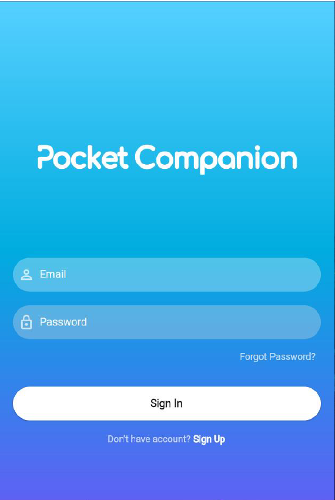

# Pocket Companion Task Management App

Pocket Companion is a mobile application developed as an individual Final Year Project (FYP). The application was designed to help users manage daily activities through task tracking, diary journaling, and personal finance management within a single platform.

The goal of the project was to provide a simple all-in-one personal productivity application that helps users organize their daily lives more effectively.

## Project Information

- **Project Type:** Final Year Project (FYP)
- **Development Type:** Individual Project
- **Platform:** Android Mobile Application
- **Development Methodology:** Agile Methodology

## Technologies Used

- Flutter
- Dart
- Firebase
- Firebase Authentication
- Cloud Firestore
- Android Studio
- Figma
- Lucidchart

## Features

### User Management

- User registration and login
- User authentication
- Cloud-based data storage

### Task Management

- Create and manage daily tasks
- Set task deadlines
- Track task completion status
- View tasks by date

### Diary Management

- Create personal diary entries
- Store daily reflections and notes
- Browse diary history

### Finance Management

- Record income and expenses
- Monitor personal financial activities
- View financial records by date

## Screenshots

### Login Screen

### Task Management

### Diary Module

### Finance Management

## Development Approach

The application was developed using the Agile methodology, allowing iterative development, testing, and continuous improvement throughout the project lifecycle.

The system uses Firebase services for user authentication and cloud data management, enabling users to access and manage their information through a centralized backend.

## My Contributions

As this was an individual Final Year Project, I was responsible for the complete development lifecycle, including:

- Requirements analysis
- System design
- UI/UX design
- Flutter application development
- Firebase integration
- User authentication implementation
- Task management module development
- Diary management module development
- Finance management module development
- Testing and debugging
- Documentation and project reporting

## Challenges and Learning Experience

This project was developed during my student exchange programme while completing my Final Year Project requirements. Due to scheduling conflicts, I completed the project before taking several software engineering and software testing courses that would normally support the development process.

As a result, the project required extensive self-learning of Flutter, Firebase, mobile application development, and software engineering practices. The experience significantly strengthened my ability to learn independently, solve technical problems, and deliver a complete software project under challenging circumstances.
